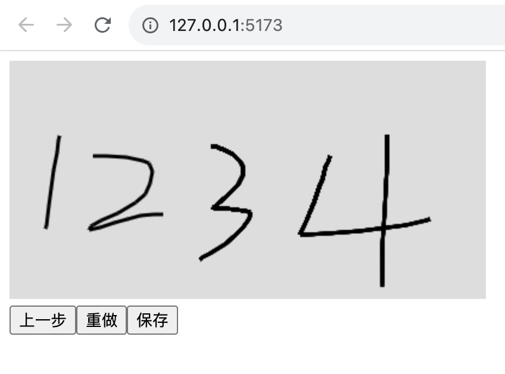

# vue3手写签名组件

## 源码使用方式
直接拷贝`/src/packages/handwritten-signature-vue3/index.vue`文件使用

## npm包使用方式
[npm地址](https://www.npmjs.com/package/handwritten-signature-vue3)

```
npm i handwritten-signature-vue3
```

### 效果图
